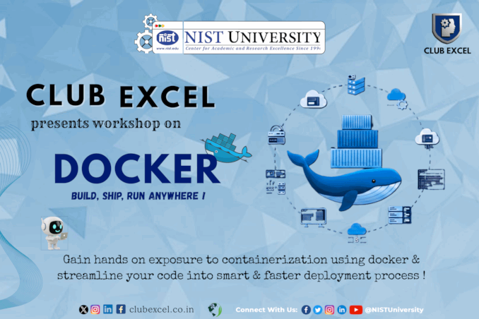

<p align="center">
  
</p>

# Docker Workshop Challenge

Your task is to containerize this Go application using Docker. The app collects your name and roll number, then sends a submission to a Discord webhook confirming you completed the challenge.

## How the App Works

When built and run, the program:
- Detects whether it is running inside a Docker container
- Prompts you for your name and roll number
- Sends a submission embed to a Discord webhook

If run outside a container, it will print an error and exit.

## Building a Go Project

To compile a Go source file into an executable:

```bash
go build -o app main.go
```

To run the executable:

```bash
./app
```

You won't need to do this manually — your Dockerfile should handle it.

## Your Task

Write a `Dockerfile` that:

1. Uses an appropriate base image
2. Copies the source code into the image
3. Compiles the Go program
4. Runs the executable when the container starts

Then build and run your image. The webhook URL is available at **[clubexcelofficial.short.gy/challenge](https://clubexcelofficial.short.gy/challenge)** — pass it as an environment variable named `DISCORD_WEBHOOK_URL` when running your container.

A successful run will send a submission to our Discord channel. Good luck!